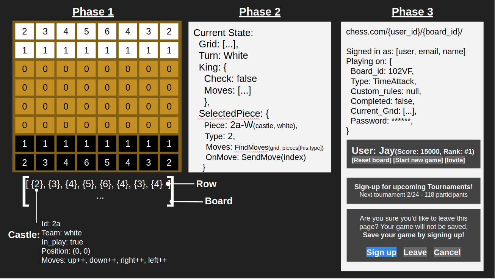

# Prompt:
How would you design the system for a two player chess game?
Please adhear to the following constraints and focus points:
* A chess board contains 64 squares
* Each player has 16 pieces: 1 king, 1 queen, 2 rooks, 2 bishops, 2 knights, and 8 pawns.
* The goal of the game is to checkmate the other king.
* Address discussions of scalability and possible fail scenarios
* DO NOT write any code literals, complete a full concept release and whiteboard
* *Optional: Include a visual guide or an image

# Solution:
### Getting Started
In developing a standard chess game; I imagine the product could be divided pretty distinctly into three separate phases "layout and structure", "rules and constraints", and "release".

#### Phase 1: Feet on the ground
The first phase is undoubtedly the most straightforward as it would revolve around generating a board which could, most simply, be represented as an 8x8 matrix and then composing each of the pieces with a basic set of properties such as the movement pattern, the team, and it's current position on the grid.

#### Phase 2: Follow the rules
As with any game the most important focus will be on the gameplay restraints as no one wants to play a broken game. In a  match of chess the highest priority would be assigned to the positioning of the pieces and the current moves available to them. By storing the move type of each piece in the properties; it would allow us to easily calculate the possible moves by running them against the current grid. In example instructing a bishop to continue moving diagonally until an obstacle occurs. The most difficult factor in this phase would be having an absolute rule set to determine what threats and aversions are present in relation to the king as even the slightest miscalculation would spoil the game entirely. Outside of rules pertaining to pieces there are also several other optional rules sets we may want to consider such as point systems or time limits.

#### Phase 3: Let them play!
After establishing and testing your ruleset you're left with the final point of production which is how you'll actually allow players to use your game. Presuming that our goal is to allow two players to connect over a network: there are a considerable amount of optimizations and scalability available to us. For starters each game would only be stored as alphanumeric dataset representing the current grid and the type of each piece present. Users would be divided into hosts and guests allowing the host to invite a guest to join their game and send requests to move pieces on the host's board. Next we discern hosts as being temp users or registered accounts; temp accounts would store boards on local memory causing them to lose their game on a page refresh and registered accounts would be able to store a game on their account to resume at a later point. By storing all the game rules and graphic content on the client end we're able to keep request times at a minimum and delegate more focus to ensuring the boards move as intended. There are no end of smaller more obscure optimizations I can make such as only storing the current threats and possible moves of the king and leaving other pieces static until they're interacted but this should, at the bare minimum, provide a solid starting point to allow end users to enjoy our product.

###### Solution provided by:
##### Samuel Bjorklund(github.com/Bjorklundsamm)
